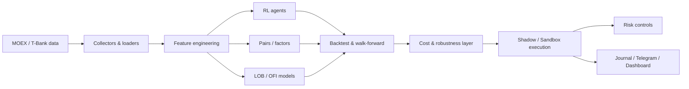

# Разработка интеллектуальной системы алгоритмической торговли акциями и фьючерсами с использованием методов обучения с подкреплением

Представляю исследовательский и программный пайплайн для систематической торговли на Московской бирже. 

> Работа не является инвестиционной рекомендацией. Реальные денежные средства в экспериментах не использовались; исполнение проводилось в песочнице.

## 1. Постановка задачи

Цель проекта — проверить, можно ли извлечь устойчивый торговый сигнал из данных MOEX с помощью методов машинного обучения и обучения с подкреплением, и построить систему, которая позволяет честно проверить такой сигнал в условиях, близких к реальной торговле.

Для этого требовалось решить пять связанных задач:

1. получить и подготовить рыночные данные;
2. реализовать несколько классов моделей и торговых стратегий;
3. отдельно оценивать результаты на данных вне той выборки, где модель обучалась или настраивалась, а также использовать проверку на будущем в контексте временных рядов;
4. учитывать комиссию, спред и проскальзывание, а не только прогнозную метрику модели;

> В алгоритмической торговле недостаточно оценивать торговую модель только по тому, насколько хорошо она предсказывает направление цены. Необходимо смотреть, приводит ли прогноз к положительному экономическому результату после издержек.
> 
> * **Спред** — разница между лучшей ценой покупки (**bid**) и лучшей ценой продажи (**ask**).
> 
> * **Феномен проскальзывания** — это отклонение фактической цены исполнения от цены, которую стратегия наблюдала в момент принятия решения. Оно возникает из-за задержек и ограниченной ликвидности рынка.
> 
> * **Ограниченная ликвидность** означает, что по текущей рыночной цене доступен ограниченный объём заявок.

6. довести исследование до виртуальных заявок через брокерский API в тестовую среду, записывать все действия и ограничивать возможные убытки.

## 2. Почему эта задача сложнее обычного ML

Финансовые данные нестабильны: закономерность, которая работала на одном периоде, может исчезнуть на следующем. Поэтому случайное разделение данных на тренировочную и тестовую выборки здесь недостаточно.

Поэтому ключевой принцип проекта — **сначала фиксировать правила на прошлом, затем проверять их на следующем временном участке без изменения параметров**.

Для этого использовались:

- **out-of-sample проверка** — тест на данных, которые не использовались при настройке;
- **forward test** — проверка строго на будущем временном участке;
- **walk-forward validation** — последовательная проверка модели на нескольких будущих окнах.


## 3. Откуда берутся данные

На ранних этапах использовались дневные и часовые свечи. 

> **Свеча** — это агрегированное представление движения цены за определённый период.

Одна свеча содержит:

* цену в начале периода;
* максимальную цену;
* минимальную цену;
* цену в конце периода (закрытия);
* объём торгов.

Позже проект был дополнен более подробными данными:

- потоком совершённых сделок;
- стаканом заявок;
- микроструктурными признаками;
- историческими данными Московской биржи из алгопака.

Для краткосрочной торговли одной информации о цене недостаточно, поэтому отдельной частью исследования стала микроструктура рынка.
Микроструктура описывает то, как непосредственно формируется цена: какие заявки выставляют покупатели и продавцы, какие объёмы находятся в стакане и какая сторона рынка проявляет большую активность.

> **Стакан заявок** — список текущих заявок участников рынка

Полный локальный cache занимает много места и не хранится в GitHub. В `data/sample/` находятся небольшие примеры форматов данных.

Код получения и подготовки данных находится в `scripts/01_download_data.py`, `scripts/30_collect_orderbook.py`, `src/data/` и `src/lob/`.

## 4. Предобработка и признаки

Для краткосрочных моделей строились признаки, описывающие не только цену, но и состояние рынка.

- `mid` - условная текущая рыночная цена;
  > **mid = (bid + ask) / 2**
- `spread_bp` — spread в базисных пунктах;
  > **spread_bp = (ask - bid) / mid × 10 000**
- `ret_1m`, `ret_5m` — краткосрочная доходность - относительное изменение цены примерно за одну и пять минут;
  >  **ret = текущая цена / прошлая цена - 1**
- `imb1`, `imb5` — дисбаланс объёма между покупателями и продавцами в стакане в конкретный момент;
  > **imbalance = (объём bid - объём ask) / (объём bid + объём ask)**
- `OFI` — Order Flow Imbalance: изменение давления заявок покупателей и продавцов между последовательными снимками стакана. Рассчитывался по изменениям лучшего bid/ask и соответствующих объёмов, после чего значения суммировались за минуту.
- `TFI` — Trade Flow Imbalance: баланс объёма уже совершённых сделок. Объём каждой сделки получал знак в зависимости от её направления, после чего подписанные объёмы суммировались за минуту.
- `micro_dev` — отклонение microprice;
  >  **micro_dev ≈ (microprice - mid) / mid**
- market breadth - доля растущих инструментов, чтобы понять, какой процент инструментов растет в условиях общего рынка.

Обработка строится так, чтобы признаки для сигнала были известны в момент входа и не содержали будущих данных.

## 5. Исследованные подходы

### 5.1. Reinforcement Learning

Реализованы Gymnasium-среды для одноактивной и портфельной торговли и агенты PPO/SAC/A2C/DQN на базе Stable-Baselines3. RL использовался как исходная гипотеза проекта, а не как заранее выбранный «победитель».

### 5.2. Статистический арбитраж

Реализованы поиск коинтегрированных пар, торговля возвратом spread к среднему и портфельное объединение пар.

### 5.3. Факторные стратегии и meta-labeling

Исследованы momentum/long-short подходы, volatility targeting, режимные фильтры и ML-фильтрация базового сигнала.

### 5.4. Микроструктура рынка

Основная исследовательская ветка использует order flow и признаки стакана. Реализованы walk-forward модели, cost-aware проверка, shadow-forward и sandbox execution.

### 5.5. Mean reversion и robustness-исследование

После первичного OFI-исследования была построена простая интерпретируемая MR-стратегия. Далее проверялись:

- ablation фильтров;
- фиксированные горизонты 30–120 минут;
- momentum как альтернативное направление;
- regime/cross-sectional фильтры;
- classifier/regression meta-gates;
- triple-barrier TP/SL/time-stop;
- sensitivity к комиссии;
- regime flip;
- независимый flow-confirmed momentum.

Карта экспериментов приведена в [`scripts/README.md`](scripts/README.md).

## 6. Методология валидации

Используются:

- временное train/validation/test-разделение;
- walk-forward анализ;
- non-overlap сделок для одного тикера;
- проверка результата без лучшего дня и без лучшего тикера;
- separate forward после фиксации стратегии;
- моделирование комиссии + половины entry/exit spread;
- sandbox для оценки расхождения между теоретическим и фактическим исполнением.

Для части ранних экспериментов также реализован PBO/CSCV-контроль переобучения.

## 7. Основные воспроизводимые результаты

Ниже приведены только те цифры, для которых в `results/` сохранён отдельный машинно-читаемый артефакт.

### 7.1. OFI / microstructure

Актуальная сводка `results/json/ofi_results.json` содержит **45 дней и 1 361 485 наблюдений**. Базовая модель показывает **ROC-AUC 0.562**. При принятой для этого эксперимента стоимости исполнения около **4.7 bp** directional edge после издержек остаётся отрицательным.

Вывод этапа: в микроструктурных признаках есть слабая предсказуемость направления, однако прогнозная метрика сама по себе недостаточна для прибыльной розничной стратегии.

### 7.2. Замороженная MR30-гипотеза

До forward-проверки была сохранена спецификация `MR30_V3_FROZEN_20260906`. Для ветки `NO_BROAD_TREND` историческая ablation-оценка составляла **514 сделок, +2.60 bp на сделку и 9 положительных дней из 11** при первоначальной более дешёвой модели исполнения.

Параметры после freeze не должны были изменяться; это отделяет исследование от подгонки по будущему периоду.

### 7.3. Forward показал деградацию

Ранний multi-day forward после freeze: **166 сделок, средний net −3.47 bp, 1 положительный день из 4**. Это показало, что исторический эффект не переносится автоматически на следующий период.

### 7.4. Triple barrier и стоимость исполнения

Для кандидата `MR_TB_SCORE_150` с `TP=60 bp`, `SL=50 bp`, `max_hold=120 min` при модельной комиссии **6 bp** pre-forward период дал:

- 131 сделку;
- +806.5 bp суммарно;
- +6.16 bp на сделку;
- 4/5 положительных временных окон;
- +470.5 bp без лучшего дня;
- +395.7 bp без лучшего тикера.

Однако на 6–9 сентября тот же заранее выбранный кандидат дал **−309.5 bp (−30.95 bp/сделку)**. При комиссии 10 bp историческая устойчивость также ухудшалась. Это один из основных примеров regime dependence в работе.

### 7.5. Sandbox: прогноз ≠ исполнение

`results/sandbox/mr30_sandbox_journal.csv` содержит реальные сделки виртуальной песочницы брокера. В текущем журнале 78 закрытий:

- gross PnL: **−52.28 RUB**;
- комиссии: **93.84 RUB**;
- net PnL: **−146.12 RUB**;
- средний net: **−12.36 bp на сделку**.

Одновременно встречались отдельные удачные сделки (например, +149.99 bp net по NVTK и +96.20 bp по GMKN), но они не компенсировали систематические издержки и не являются основанием считать стратегию прибыльной. Примеры вынесены в `results/tables/sandbox_best_trade_examples.csv`.

### 7.6. Дополнительные robustness-тесты

Regime-flip и независимая flow-confirmed momentum ветка не дали конфигурации, одновременно проходящей заранее заданные pre-period, 6–9 сентября и свежий forward-критерии. Отрицательный результат сохранён как часть исследования, а не скрыт постфактум.

## 8. Главный вывод

Проект показал различие между **статистической предсказуемостью** и **экономически извлекаемым сигналом**.

Слабый short-horizon signal в данных MOEX обнаруживается, но его устойчивость зависит от рыночного режима, а величина edge сопоставима с транзакционными издержками. После перехода от backtest к forward и sandbox часть красивых исторических результатов исчезает. Поэтому итог проекта — не обещание гарантированной доходности, а воспроизводимая система, которая умеет **отбраковывать гипотезы до использования реального капитала**.

## 9. Архитектура



Основные каталоги:

```text
src/        библиотечный код
tests/      unit-тесты
scripts/    воспроизводимые эксперименты 00–73
dashboard/  Streamlit-мониторинг
docs/       архитектура, quickstart и техническая документация
results/    компактные итоговые артефакты
data/sample небольшие примеры форматов данных
```

## 10. Как запустить

### Установка

```bash
git clone https://github.com/hansfalafelfalafel/algo2026tradbot.git
cd algo2026tradbot
python -m venv .venv
source .venv/bin/activate  # Windows: .venv\\Scripts\\activate
pip install -r requirements.txt
```

SDK T-Bank устанавливается отдельно согласно инструкции в `requirements.txt` / `docs/QUICKSTART.md`.

Создайте локальный `.env` по примеру `.env.example`. Токены не должны попадать в Git.

### Минимальный pipeline

```bash
python scripts/01_download_data.py
python scripts/02_train.py
python scripts/03_backtest.py
```

Для микроструктуры и поздних research-экспериментов необходим полный локальный cache. Маленькие примеры форматов лежат в `data/sample/`.

## 11. Проверка качества кода

```bash
python -m compileall -q src scripts tests dashboard
pytest -q
flake8 src tests dashboard --max-line-length=120
pylint src --max-line-length=120 --disable="C0103,C0114,C0115"
```

## 12. Ограничения

- полный market-data cache не публикуется из-за размера;
- результаты чувствительны к модели комиссии и типу исполнения;
- short-horizon сигналы подвержены regime drift;
- часть research-скриптов отражает хронологию экспериментов и намеренно сохранена для воспроизводимости;
- отдельные ML-эксперименты требуют дополнительного purge/embargo при использовании их метрик как строгого out-of-sample доказательства;
- sandbox не эквивалентен гарантированному реальному fill/execution.

## 13. Дальнейшее развитие

1. накопить более длинную историю микроструктурных данных;
2. использовать purged/embargoed walk-forward для ML meta-models;
3. отдельно моделировать maker/taker execution и реальные тарифы;
4. исследовать longer-horizon alpha, где комиссия составляет меньшую долю ожидаемого движения;
5. продолжить shadow/sandbox до накопления статистически достаточного fresh-forward периода;
6. расширить risk layer и автоматический мониторинг drift.

## 14. Дополнительная документация

- [`docs/ARCHITECTURE.md`](docs/ARCHITECTURE.md) — подробная архитектура;
- [`docs/EDGE_ARCHITECTURE.md`](docs/EDGE_ARCHITECTURE.md) — исследовательская логика поиска edge;
- [`docs/QUICKSTART.md`](docs/QUICKSTART.md) — установка и запуск;
- [`docs/README_DEV.md`](docs/README_DEV.md) — карта исходного кода;
- [`scripts/README.md`](scripts/README.md) — карта экспериментов;
- [`results/README.md`](results/README.md) — описание сохранённых результатов.
