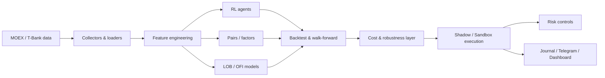

# Разработка интеллектуальной системы алгоритмической торговли акциями и фьючерсами с использованием методов обучения с подкреплением

Представляю исследовательский и программный пайплайн для систематической торговли на Московской бирже. 

> Работа не является инвестиционной рекомендацией. Реальные денежные средства в экспериментах не использовались; исполнение проводилось в песочнице.

## 1. Постановка задачи

Цель проекта — проверить, можно ли извлечь устойчивый торговый сигнал из данных MOEX с помощью методов машинного обучения и обучения с подкреплением, и построить систему, которая позволяет честно проверить такой сигнал в условиях, близких к реальной торговле.

Для этого требовалось решить пять связанных задач:

1. получить и подготовить рыночные данные;
2. реализовать несколько классов моделей и торговых стратегий;
3. отдельно оценивать результаты на данных вне той выборки, где модель обучалась или настраивалась, а также использовать проверку на будущем в контексте временных рядов;
4. учитывать комиссию, спред и проскальзывание, а не только прогнозную метрику модели;

> В алгоритмической торговле недостаточно оценивать торговую модель только по тому, насколько хорошо она предсказывает направление цены. Необходимо смотреть, приводит ли прогноз к положительному экономическому результату после издержек.
> 
> * **Спред** — разница между лучшей ценой покупки (**bid**) и лучшей ценой продажи (**ask**).
> 
> * **Феномен проскальзывания** — это отклонение фактической цены исполнения от цены, которую стратегия наблюдала в момент принятия решения. Оно возникает из-за задержек и ограниченной ликвидности рынка.
> 
> * **Ограниченная ликвидность** означает, что по текущей рыночной цене доступен ограниченный объём заявок.

6. довести исследование до виртуальных заявок через брокерский API в тестовую среду, записывать все действия и ограничивать возможные убытки.

## 2. Почему эта задача сложнее обычного ML

Финансовые данные нестабильны: закономерность, которая работала на одном периоде, может исчезнуть на следующем. Поэтому случайное разделение данных на тренировочную и тестовую выборки здесь недостаточно.

Поэтому ключевой принцип проекта — **сначала фиксировать правила на прошлом, затем проверять их на следующем временном участке без изменения параметров**.

Для этого использовались:

- **out-of-sample проверка** — тест на данных, которые не использовались при настройке;
- **forward test** — проверка строго на будущем временном участке;
- **walk-forward validation** — последовательная проверка модели на нескольких будущих окнах.


## 3. Откуда берутся данные

На ранних этапах использовались дневные и часовые свечи. 

> **Свеча** — это агрегированное представление движения цены за определённый период.

Одна свеча содержит:

* цену в начале периода;
* максимальную цену;
* минимальную цену;
* цену в конце периода (закрытия);
* объём торгов.

Позже проект был дополнен более подробными данными:

- потоком совершённых сделок;
- стаканом заявок;
- микроструктурными признаками;
- историческими данными Московской биржи из алгопака.

Для краткосрочной торговли одной информации о цене недостаточно, поэтому отдельной частью исследования стала микроструктура рынка.
Микроструктура описывает то, как непосредственно формируется цена: какие заявки выставляют покупатели и продавцы, какие объёмы находятся в стакане и какая сторона рынка проявляет большую активность.

> **Стакан заявок** — список текущих заявок участников рынка

Полный локальный кэш занимает много места и не хранится в GitHub. В `data/sample/` находятся небольшие примеры форматов данных.

Код получения и подготовки данных находится в `scripts/01_download_data.py`, `scripts/30_collect_orderbook.py`, `src/data/` и `src/lob/`.

## 4. Предобработка и признаки

Для краткосрочных моделей строились признаки, описывающие не только цену, но и состояние рынка.

- `mid` - условная текущая рыночная цена;
  > **mid = (bid + ask) / 2**
- `spread_bp` — spread в базисных пунктах;
  > **spread_bp = (ask - bid) / mid × 10 000**
- `ret_1m`, `ret_5m` — краткосрочная доходность - относительное изменение цены примерно за одну и пять минут;
  >  **ret = текущая цена / прошлая цена - 1**
- `imb1`, `imb5` — дисбаланс объёма между покупателями и продавцами в стакане в конкретный момент;
  > **imbalance = (объём bid - объём ask) / (объём bid + объём ask)**
- `OFI` — Order Flow Imbalance: изменение давления заявок покупателей и продавцов между последовательными снимками стакана. Рассчитывался по изменениям лучшего bid/ask и соответствующих объёмов, после чего значения суммировались за минуту.
- `TFI` — Trade Flow Imbalance: баланс объёма уже совершённых сделок. Объём каждой сделки получал знак в зависимости от её направления, после чего подписанные объёмы суммировались за минуту.
- `micro_dev` — отклонение microprice;
  >  **micro_dev ≈ (microprice - mid) / mid**
- market breadth - доля растущих инструментов, чтобы понять, какой процент инструментов растет в условиях общего рынка.

Обработка строится так, чтобы признаки для сигнала были известны в момент входа и не содержали будущих данных.

## 5. Исследованные подходы

Изначально проект был сосредоточен на обучении с подкреплением. 
В этом подходе агент последовательно получает состояние рынка, выбирает действие и получает за него награду или штраф.

Были протестированы алгоритмы PPO, SAC, A2C и DQN.

Для их реализации использовалась библиотека **Stable-Baselines3**, в которой эти алгоритмы уже реализованы.
В качестве награды использовался подход, учитывающий не только доходность, но и риск. В частности, использовалась идея **коэффициента Шарпа**.

Однако сложную RL-модель необходимо сравнивать с более простыми и интерпретируемыми подходами. Поэтому параллельно в проекте исследовались классические торговые стратегии и ML-модели.

- **Momentum** — стратегия продолжения движения. Если цена инструмента уже достаточно сильно движется в одну сторону, предполагается, что движение может продолжиться.

  В коде momentum-сигнал строился на основе стандартизированных доходностей за 1 и 5 минут. Сначала рассчитывались z-score для `ret_1m` и `ret_5m`, после чего формировался итоговый score:

  > **score_mom = 0.75 × z(ret_5m) + 0.25 × z(ret_1m)**

  Чем выше `score_mom`, тем сильнее восходящий импульс. Положительный score соответствовал long-сигналу, отрицательный — short-сигналу. Сделка рассматривалась только при достаточно сильном сигнале и небольшом spread.

- **Mean Reversion** — стратегия возврата к среднему. Если цена за короткий период отклонилась слишком сильно относительно своего обычного поведения, предполагается, что часть движения может быть временной и цена частично вернётся обратно.

  В коде использовался противоположный momentum-подход:

  > **score_mr = -0.75 × z(ret_5m) - 0.25 × z(ret_1m)**

  Поэтому сильное недавнее падение давало положительный mean-reversion score и потенциальный сигнал на покупку, а сильный рост — сигнал в противоположную сторону.

  Для сделок также применялись порог силы сигнала, ограничение по spread и дополнительные фильтры состояния рынка.

- **Парный арбитраж (Pairs Trading)** — стратегия, в которой ищутся два инструмента с устойчивой статистической связью.

  Для отбора пар использовалась проверка на коинтеграцию (статистическая схожесть временных рядов). После этого рассчитывалось отклонение спреда между двумя инструментами от его обычного уровня. Если расхождение становилось достаточно большим, стратегия открывала позиции с ожиданием восстановления прежнего соотношения цен.


- **Meta-labeling** — подход, при котором машинное обучение используется не для самостоятельного поиска сделки, а для фильтрации уже существующих сигналов.

  Сначала базовая стратегия формировала сигнал. После этого дополнительная ML-модель оценивала вероятность того, что конкретная сделка окажется успешной.

  В наших экспериментах для такой фильтрации использовались модели градиентного бустинга.


- **Модели микроструктуры рынка** — модели, которые используют не только движение цены, но и более подробную информацию о состоянии стакана и потоке сделок.

  Помимо классических ML-моделей, исследовалась **GRU — Gated Recurrent Unit**.

  > **GRU** — разновидность рекуррентной нейронной сети, предназначенная для работы с последовательностями. Она позволяет учитывать не только текущее значение признаков, но и то, как они изменялись в предыдущие моменты времени.

Эксперименты на дневных и часовых данных показали, что многие зависимости плохо переносятся на следующие периоды. Поэтому основной исследовательский фокус постепенно сместился в сторону микроструктуры рынка.

Карта экспериментов приведена в [`scripts/README.md`](scripts/README.md).

## 6. Методология валидации

Используются:

- временное разделение на тренировочную, валидационную и тестовую выборки;
- несколько последовательных проверок во времени;
- один сигнал для сделки;
- проверка результата без лучшего дня и без лучшего тикера;
- заморозка параметров и тест после фиксации стратегии;
- моделирование комиссии;
- песочница для оценки расхождения между теоретическим и фактическим исполнением.

## 7. Основные воспроизводимые результаты

Ниже приведены результаты, для которых в проекте сохранены отдельные артефакты в каталоге `results/`.

### 7.1. OFI / microstructure

Актуальная сводка `results/json/ofi_results.json` содержит **45 дней и 1 361 485 наблюдений**. 
Базовая модель показывает **ROC-AUC 0.562**. При принятой для этого эксперимента стоимости исполнения около **4.7 bp** результат после издержек остаётся отрицательным.

Вывод этапа: в микроструктурных признаках есть слабая предсказуемость направления, однако прогнозная метрика сама по себе недостаточна для прибыльной розничной стратегии.

### 7.2. Замороженная MR30-гипотеза

Одной из наиболее перспективных гипотез стала краткосрочная стратегия **Mean Reversion MR30**.
Перед проверкой на новых данных её параметры были зафиксированы в конфигурации:

`MR30_V3_FROZEN_20260906`

Для варианта `NO_BROAD_TREND` исторический результат составлял:

- **514 сделок**;
- **+2.60 bp среднего результата на сделку**;
- **9 положительных дней из 11**.

После этого формула стратегии, пороги и фильтры были заморожены и больше не изменялись.
Такой freeze нужен для того, чтобы следующий период действительно являлся новой проверкой стратегии, а не очередной подгонкой под уже известные данные.

**Итог**: Ранний тест показал **166 сделок, средний net −3.47 bp, 1 положительный день из 4**. Это показало, что исторический эффект не переносится автоматически на следующий период.

### 7.4. Triple barrier и стоимость исполнения

Дополнительно исследовалась схема выхода из сделки **Triple Barrier**.

Для каждой позиции задавались три условия закрытия:

- `Take Profit` — фиксация прибыли;
- `Stop Loss` — ограничение убытка;
- `Time Stop` — максимальное время удержания позиции.

Для кандидата `MR_TB_SCORE_150` использовались:

- `TP = 60 bp`;
- `SL = 50 bp`;
- `max_hold = 120 min`.

При модельной стоимости исполнения **6 bp** исторический период дал:

- **131 сделку**;
- **+806.5 bp суммарно**;
- **+6.16 bp в среднем на сделку**;
- положительный результат в **4 из 5 временных окон**;
- **+470.5 bp** после удаления лучшего дня;
- **+395.7 bp** после удаления лучшего тикера.

Это означало, что исторический результат не зависел только от одного особенно удачного дня или одной акции.

Однако на следующем периоде, 6–9 сентября, та же заранее выбранная стратегия получила:

- **−309.5 bp суммарно**;
- **−30.95 bp на сделку**.

При увеличении моделируемой комиссии до **10 bp** историческая устойчивость также заметно ухудшалась.

Этот эксперимент показал две проблемы одновременно:

1. чувствительность стратегии к торговым издержкам;
2. изменение поведения стратегии при смене рыночного режима.

### 7.5. Реальные сделки виртуальной песочницы

`results/sandbox/mr30_sandbox_journal.csv` содержит реальные сделки виртуальной песочницы брокера. В текущем журнале 78 закрытий:

- gross PnL: **−52.28 RUB**;
- комиссии: **93.84 RUB**;
- net PnL: **−146.12 RUB**;
- средний net: **−12.36 bp на сделку**.

Одновременно встречались отдельные удачные сделки (например, +149.99 bp net по NVTK и +96.20 bp по GMKN), но они не компенсировали систематические издержки и не являются основанием считать стратегию прибыльной. Примеры вынесены в `results/tables/sandbox_best_trade_examples.csv`.

## 8. Главный вывод

Проект показал различие между **статистической предсказуемостью** и **экономически извлекаемым сигналом**.

Слабый сигнал в данных MOEX обнаруживается, но его устойчивость зависит от рыночного режима, а величина сигнала сопоставима с транзакционными издержками. После перехода от теста на исторических данных к тестам на будущем и песочнице часть красивых исторических результатов исчезает. Поэтому итог проекта — не обещание гарантированной доходности, а воспроизводимая система, которая умеет **отбраковывать гипотезы до использования реального капитала**.

## 9. Архитектура



Основные каталоги:

```text
src/        библиотечный код
tests/      unit-тесты
scripts/    воспроизводимые эксперименты 00–73
dashboard/  Streamlit-мониторинг
docs/       архитектура, quickstart и техническая документация
results/    компактные итоговые артефакты
data/sample небольшие примеры форматов данных
```

## 10. Как запустить

### Установка

```bash
git clone https://github.com/hansfalafelfalafel/algo2026tradbot.git
cd algo2026tradbot
python -m venv .venv
source .venv/bin/activate  # Windows: .venv\\Scripts\\activate
pip install -r requirements.txt
```

SDK T-Bank устанавливается отдельно согласно инструкции в `requirements.txt` / `docs/QUICKSTART.md`.

Создайте локальный `.env` по примеру `.env.example`. Токены не должны попадать в Git.

### Минимальный pipeline

```bash
python scripts/01_download_data.py
python scripts/02_train.py
python scripts/03_backtest.py
```

Для микроструктуры и поздних research-экспериментов необходим полный локальный cache. Маленькие примеры форматов лежат в `data/sample/`.

## 11. Проверка качества кода

```bash
python -m compileall -q src scripts tests dashboard
pytest -q
flake8 src tests dashboard --max-line-length=120
pylint src --max-line-length=120 --disable="C0103,C0114,C0115"
```

## 12. Ограничения

- полный кэш данных не публикуется из-за размера;
- результаты чувствительны к модели комиссии и типу исполнения;
- краткосрочные зависимости могут быстро меняться при смене рыночного режима.
- часть исследовательских скриптов отражает хронологию экспериментов и намеренно сохранена для воспроизводимости;
- песочница не эквивалентна гарантированному реальному положению рынка на бирже.

## 13. Дальнейшее развитие

1. накопить более длинную историю микроструктурных данных;
2. более строгая временная валидация для ML-моделей;
3. тдельное моделирование разных типов исполнения заявок;
4. исследование более длинных торговых горизонтов, где комиссия составляет меньшую долю ожидаемого движения;
5. более длительная проверка на свежих данных в режиме реального времени;
6. автоматический контроль изменения рыночного режима;
7. дальнейшее развитие системы управления рисками.

## 14. Дополнительная документация

- [`docs/ARCHITECTURE.md`](docs/ARCHITECTURE.md) — подробная архитектура;
- [`docs/EDGE_ARCHITECTURE.md`](docs/EDGE_ARCHITECTURE.md) — исследовательская логика поиска edge;
- [`docs/QUICKSTART.md`](docs/QUICKSTART.md) — установка и запуск;
- [`docs/README_DEV.md`](docs/README_DEV.md) — карта исходного кода;
- [`scripts/README.md`](scripts/README.md) — карта экспериментов;
- [`results/README.md`](results/README.md) — описание сохранённых результатов.
